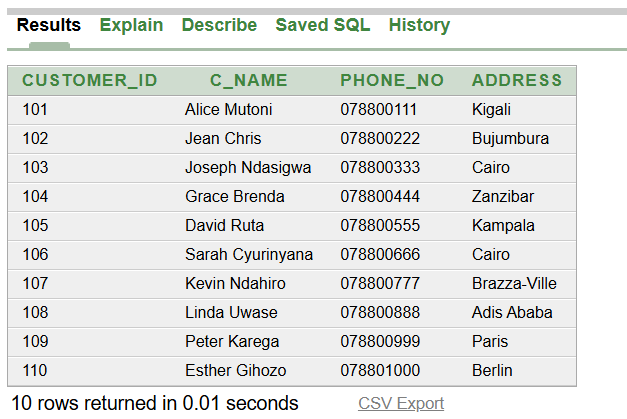
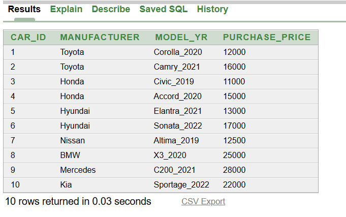
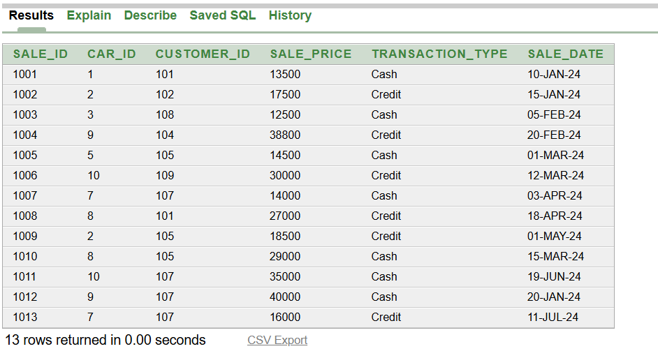

# Using SQL JOINs & Window Functions Assignment - Car Sales Analysis

**Names:** GIHOZO UWASE Vanessa

**Student_ID:** 28863

**Lecturer:** Eric MANIRAGUHA

**Course:** Database Development with PL/SQL

**Wednesday-Group A**

**Date:** 6th February 2026

## Business Problem
### Business Context
A car dealership manages inventory, customers, and sales transactions across different car models, price ranges, and time periods. Management needs clear, data-driven insights to understand sales performance, customer behavior, and inventory efficiency in order to improve profitability and operational decisions.
### Data Challenge
The company struggles to identify *unsold cars*, *inactive customers*, *sales trends over time*, and *high-value customers* because data is spread across multiple tables without analytical reporting.
### Expected Outcome
- Provide ways to support better pricing strategies.
- Apply effective marketing targeting customer segments.
- Discover the top bought cars in each region.
- Inventory planning by using SQL JOINs and Window Functions to extract meaningful insights from relational data.
#### 5 Smart Goals to achieve:
- Identify the top 5 best-selling products per region or quarter for performance comparison and prioritization. *Using RANK() function*
- Track running monthly sales totals to monitor cumulative revenue growth. *Using SUM() OVER() function*
- Analyze month-over-month sales changes to detect growth or decline trends. *Using LAG() or LEAD() fucntions*
- Segment customers into four spending-based quartiles for targeted marketing strategies. *Using NTILE(4)*
- Calculate three-month moving averages to smooth fluctuations and support reliable forecasting. *Using AVG() OVER() function*
## Database Schema
- **Description of [Customers Table](SQL_Queries/create_customer.sql)**

 

**Customers Table Details**

 

- **Description of [Inventoty Table](SQL_Queries/create_inv.sql)**


**Inventory Table Details**



- **Description of [Sales Table](SQL_Queries/create_sales.sql)**


**Sales Table Details**



#### ER-Diagram of Car Dealership Database


## Part A: SQL JOIN Queries

**1. INNER JOIN**

```sql
-- Combines customers with their completed transactions, returning only records where both customer and sales data exist.
SELECT s.Sale_ID,
       c.C_Name AS Customer_Name,
       i.Model_Yr,
       s.Sale_Price
FROM Sales s
INNER JOIN Customers c ON s.Customer_ID = c.Customer_ID
INNER JOIN Inventory i ON s.Car_ID = i.Car_ID;
```


**Business interpretation:** Shows active customers generating revenue, helping leadership focus on proven revenue contributors.

**2. LEFT JOIN**

```sql
-- Returns all customers without any recorded purchases.
SELECT c.Customer_ID,
       c.C_Name
FROM Customers c
LEFT JOIN Sales s ON c.Customer_ID = s.Customer_ID
WHERE s.Sale_ID IS NULL;
```


**Business interpretation:** Identifies inactive or untapped customers, highlighting opportunities for re-engagement and growth.

**3. RIGHT JOIN**

```sql
-- Displays all cars, that are not linked to a registered customer record.
SELECT i.Car_ID,
       i.Manufacturer,
       i.Model_Yr
FROM Sales s
RIGHT JOIN Inventory i ON s.Car_ID = i.Car_ID
WHERE s.Sale_ID IS NULL;
```


**Business interpretation:** Exposes data capture gaps, supporting improvements in customer tracking and reporting accuracy.

**4. FULL OUTER JOIN**

```sql
-- Combines all customers and all transactions, regardless of matching records.
SELECT c.C_Name AS Customer_Name,
       i.Model_Yr
FROM Customers c
FULL OUTER JOIN Sales s ON c.Customer_ID = s.Customer_ID
FULL OUTER JOIN Inventory i ON s.Car_ID = i.Car_ID;
```   


**Business interpretation:** Provides a complete business view, revealing both missing customers and missing sales links.

**5. SELF JOIN**

```sql
-- Compares customers within the same table to identify shared attributes which is region.
SELECT c1.C_Name AS Customer1,
       c2.C_Name AS Customer2,
       c1.Address
FROM Customers c1
JOIN Customers c2
  ON c1.Address = c2.Address
 AND c1.Customer_ID <> c2.Customer_ID;
```


**Business interpretation:** This helps identify customer segments and shared behaviors, enabling leadership to identify high-value segments and leverage peer influence for rapid growth and targeted marketing.

## Part B: Window Functions

### 1. Ranking Functions

- **ROW_NUMBER()**

```sql
-- Assigns a unique sequential number to each customer transaction within a defined group(Sales number).
SELECT 
    c.C_name AS Customer_Name,
    s.sale_date,
    s.sale_price,
    ROW_NUMBER() OVER (PARTITION BY s.customer_id ORDER BY s.sale_date) AS Sales_number
FROM sales s
JOIN customers c ON s.customer_id = c.customer_id
ORDER BY c.C_name, s.sale_date;
```

.png)

**Business Interpretation:** This allows us to track first-time vs repeat purchases, giving insight into customer loyalty and lifecycle stages. Executives can measure how well the business converts new customers into repeat buyers.

- **RANK()**

```sql
-- Ranks customers based on spending value, without ties.
SELECT i.Manufacturer,
       i.Model_Yr,
       s.Sale_Price,
       RANK() OVER (ORDER BY s.Sale_Price DESC) AS Price_Rank
FROM Sales s
JOIN Inventory i ON s.Car_ID = i.Car_ID;
```
.png)

**Business interpretation:** This highlights top-spending customers, helping leadership prioritize VIP retention strategies and personalized offerings that protect and grow high-value revenue streams.

- **DENSE_RANK()**

```sql
-- Ranks customers without gaps in purchase ranking values.
SELECT c.Customer_ID,
       c.C_Name,
       SUM(s.Sale_Price) AS Total_Spent,
       DENSE_RANK() OVER (ORDER BY SUM(s.Sale_Price) DESC) AS Purchasing_Rank
FROM Customers c
JOIN Sales s ON c.Customer_ID = s.Customer_ID
GROUP BY c.Customer_ID, c.C_Name;
```

.png)

**Business interpretation:** This ensures fair segmentation of customers by value, enabling precise reward tiers and loyalty programs without artificial ranking gaps that could distort performance reporting.

- **PERCENT_RANK()**

```sql
-- Calculates a customer’s relative position compared to all other customers in percentages.
SELECT 
    i.manufacturer AS Car_Type,
    SUM(s.sale_price) AS Total_revenue,
    ROUND(PERCENT_RANK() OVER (ORDER BY SUM(s.sale_price)) * 100, 2) AS percent_rank
FROM sales s
JOIN inventory i ON s.car_id = i.car_id
GROUP BY i.manufacturer
ORDER BY total_revenue DESC;
```

.png)

**Business interpretation:** This shows how customers perform relative to the entire base, allowing executives to quickly identify whether a customer is in the top or bottom performance percentile and allocate resources accordingly.

### 2. Aggregate Window Functions

- **SUM() OVER()**

```sql
-- Computes cumulative or rolling customer revenue over time using defined row frames.
SELECT 
    s.Sale_Date,
    s.Sale_Price,
    i.Purchase_Price,
    (s.Sale_Price - i.Purchase_Price) AS Profit,
    SUM(s.Sale_Price) OVER (
        ORDER BY s.Sale_Date
        ROWS BETWEEN UNBOUNDED PRECEDING AND CURRENT ROW
    ) AS Running_Total
FROM Sales s
JOIN Inventory i
    ON s.car_id = i.car_id;
```

.png)

**Business interpretation:** This tracks customer lifetime value growth, helping leadershiP assess whether customer relationships are becoming more profitable and whether retention strategies are working.

- **AVG() OVER()**

```sql
-- Calculates cumulative average customer spending.
SELECT c.Customer_ID,
       c.C_Name,
       s.Sale_Price,
       ROUND(AVG(s.Sale_Price) OVER (PARTITION BY c.Customer_ID), 2) AS Avg_Spent
FROM Customers c
JOIN Sales s ON c.Customer_ID = s.Customer_ID;
```

.png)

**Business interpretation:** This smooths out short-term fluctuations to reveal true spending behavior trends, enabling informed decisions about pricing, promotions, and long-term revenue forecasting.

- **MIN() OVER()/MAX() OVER()**

```sql
-- Identifies minimum and maximum transaction values per customer.
SELECT 
    i.Manufacturer AS Car_Type,
    s.sale_date,
    s.sale_price,
    MIN(s.sale_price) OVER (PARTITION BY i.car_id) AS min_sale_amount,
    MAX(s.sale_price) OVER (PARTITION BY i.car_id) AS max_sale_amount
FROM sales s
JOIN inventory i ON s.car_id = i.car_id
ORDER BY i.manufacturer, s.sale_date;
```

.png)

**Business interpretation:** This reveals customer spending boundaries, helping leadership understand risk, detect unusually low or high transactions, and refine customer segmentation strategies.

### 3. Navigation Functions

- **LAG()**

```sql
-- Compares a customer’s current transaction to their previous transaction.
SELECT
    Sale_Month,
    Monthly_Sales,
    LAG(Monthly_Sales) OVER (ORDER BY Sale_Month) AS Previous_Month_Sales,
    Monthly_Sales
      - LAG(Monthly_Sales) OVER (ORDER BY Sale_Month) AS Sales_Change
FROM (
    SELECT
        TO_CHAR(Sale_Date, 'YYYY-MM') AS Sale_Month,
        SUM(Sale_Price) AS Monthly_Sales
    FROM Sales
    GROUP BY TO_CHAR(Sale_Date, 'YYYY-MM')
)
ORDER BY Sale_Month;
```

.png)

**Business interpretation:** This measures changes in customer behavior over time, signaling whether customers are increasing or decreasing their spending a critical early indicator of churn or growth potential.

- **LEAD()**

```sql
-- Compares a customer’s current transaction with their next transaction.
SELECT 
       c.C_Name,
       s.Sale_Date,
       s.Sale_Price,
       LEAD(s.Sale_Price) OVER (
           PARTITION BY c.Customer_ID
           ORDER BY s.Sale_Date
       ) AS Next_Purchase
FROM Customers c
JOIN Sales s ON c.Customer_ID = s.Customer_ID;
```

.png)

**Business interpretation:** This supports predictive analysis, allowing management to anticipate future customer behavior and proactively intervene to retain or upsell customers.

### 4. Distribution Functions

- **NTILE(4)**

```sql
-- Divides customers into four equal-sized spending groups (quartiles).
SELECT Customer_ID,
       Customer_Name,
       Total_Spent,
       NTILE(4) OVER (ORDER BY Total_Spent DESC NULLS LAST) AS Customer_Quartile,
         CASE NTILE(4) OVER (ORDER BY Total_Spent DESC NULLS LAST)
        WHEN 1 THEN 'VVIP'  -- Quartile 1: Highest Spenders
        WHEN 2 THEN 'MIP'       -- Quartile 2: Next Highest Spenders
        WHEN 3 THEN 'VIP'     -- Quartile 3: Mid-Range Spenders
        WHEN 4 THEN 'IP'    -- Quartile 4: Lowest Spenders
    END AS customer_status
FROM (
        SELECT c.Customer_ID,
               c.C_Name AS Customer_Name,
               SUM(s.Sale_Price) AS Total_Spent
        FROM Customers c
        LEFT JOIN Sales s
          ON c.Customer_ID = s.Customer_ID
        GROUP BY c.Customer_ID, c.C_Name
     );
```

.png)

**Business interpretation:** This creates clear customer value tiers, enabling leadership to focus investment on top-quartile customers while designing growth strategies for mid- and low-tier segments.

- **CUME_DIST()**

```sql
-- Calculates the cumulative distribution of customer spending.
SELECT c.Customer_ID,
       c.C_Name,
       SUM(s.Sale_Price) AS Total_Spent,
       ROUND(CUME_DIST() OVER (ORDER BY SUM(s.Sale_Price))*100, 2) AS Spending_Distribution
FROM Customers c
JOIN Sales s ON c.Customer_ID = s.Customer_ID
GROUP BY c.Customer_ID, c.C_Name;
```

.png)

**Business interpretation:** This shows what percentage of customers spend less than or equal to a given customer, offering a powerful view of revenue concentration and helping executives assess dependence on high-value customers.

## Key Insights
- Unsold cars were identified
- Inactive customers were detected
- Sales trends were observed clearly
- Customer segments was well defined

## Results Analysis
### Descriptive(What happened?)

Summarizes historical car sales and customer activity to show:

- Total sales performance and revenue trends
- Active vs inactive car buyers
- Top-selling vehicles and high-value customers
- Sales distribution across regions and time periods

Business value:
Provides a clear snapshot of sales performance and customer behavior.

### Diagnostic(Why did it happen?)

Examines patterns behind sales results by identifying:

- Why certain customers and vehicle models perform better
- Which customer segments drive most revenue
- Where sales increases or declines occur
- Data quality gaps affecting customer tracking

Business value:
Helps management understand sales drivers and performance gaps.

### Prescriptive(What should be done?)

Uses insights to recommend actions such as:

- Retaining high-value car buyers through loyalty programs
- Targeting underperforming customer segments
- Optimizing inventory based on customer demand trends
- Improving customer data capture and reporting systems

Business value:
Supports data-driven decisions to increase sales, reduce churn, and improve profitability.

## References

1. Oracle Corporation. Oracle Database SQL Language Reference.
Used for SQL syntax, JOIN operations, and window functions implementation.
2. Oracle Corporation. Oracle Database Data Warehousing Guide.
Referenced for analytical SQL concepts, window functions, and performance-oriented queries.
3.Microsoft Documentation. SQL Window Functions Overview.
Used conceptually for understanding ranking, distribution, and navigation functions.
4. GeeksforGeeks SQL Analytical Functions
5. YouTube turtorials
6. Database with PL/SQL Lecture Notes

## Integrity Statement
All sources were properly cited. Implementations and analysis represent original work. No AIgenerated content was copied without attribution or adaptation
